<h3>Inventory Management System</h3>

<h2>Introduction</h2>
 Django application which tracks the available products in the inventory. Basically there are two types of users in this application Staff and Admin. Staff are the normal employee of the Inventory where they can sell the available products in the inventory whereas Admin on the other hand can add products, keeps track of product in, product out, make reports, can see the total sales of the product of certain date and can view all the staff details. 

 Also Build the API of the project using Restful API along with token athentication. 

<h2>Features For Staff</h2>

 * First staff must be logged in into the system. 
 * Staff can update their profile and can add their profile image. 
 * Staff can see the available products in the Inventory 
 * Staff can search the available products. (Jquery auto complete) 
 * Staff can sales the product 

<h3>Staff Dashboard</h3>

 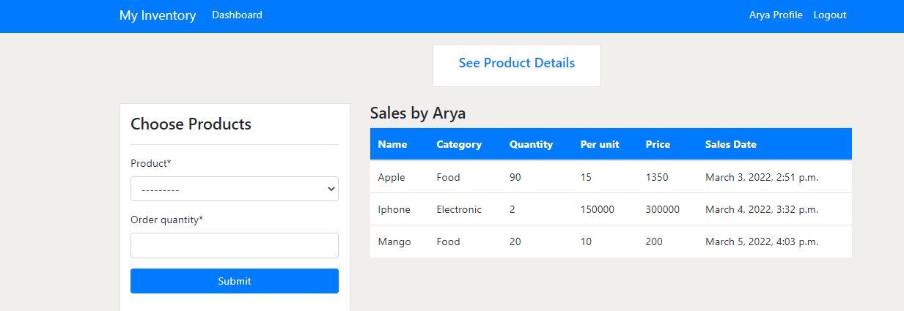  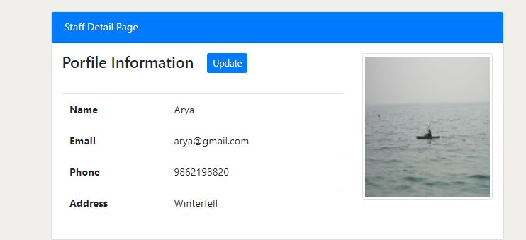

 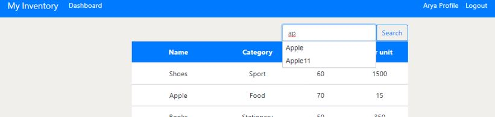

 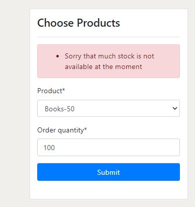

 If the product quantity is less than the sales quantity then the warning message will appear like above.  

<h1>Features of Admin</h1>

 * Admin must be logged in into the system. 
 * Admin have own profile and can update the profile 
 * Admin can view the details of all the staff registered in the system. 
 * Admin can add, update and delete the products available in the Inventory. 
 * Admin can search the available products according to category. 
 * Admin can keep track of product out, product in and can make reports of product sales. 
 * Admin can add the quantity of product if a particular product quantity is about to finish. 
 * Admin can view the sales made by the staff. 

<h3>Admin Dashboard</h3>

 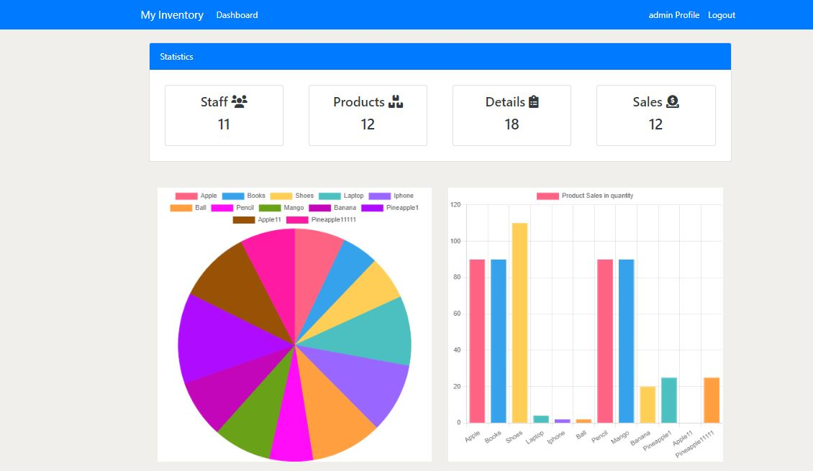  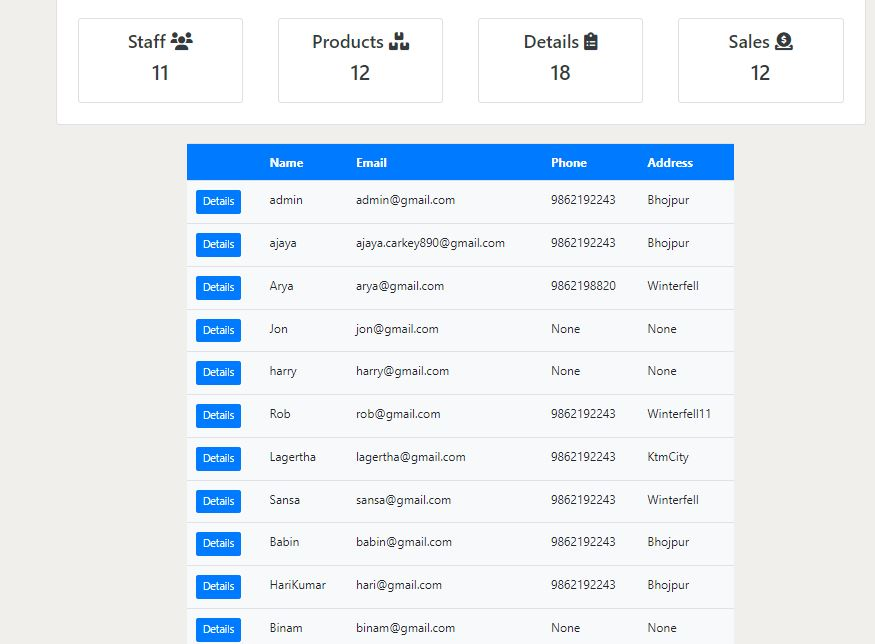  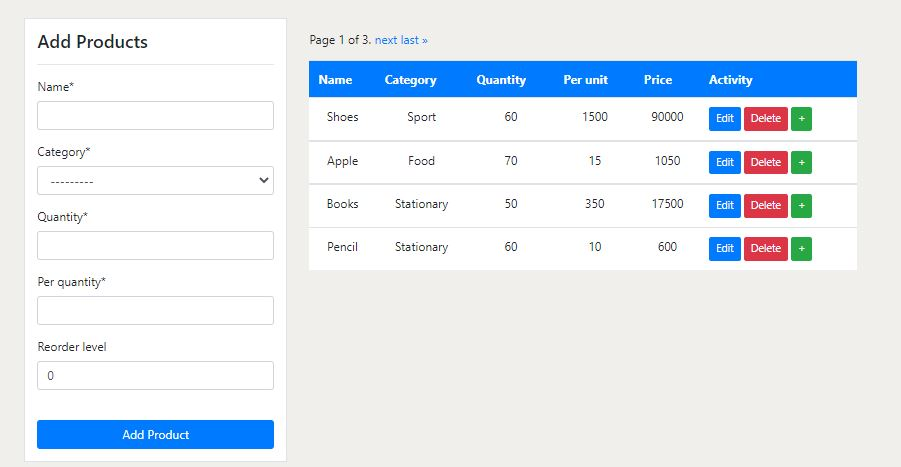 

 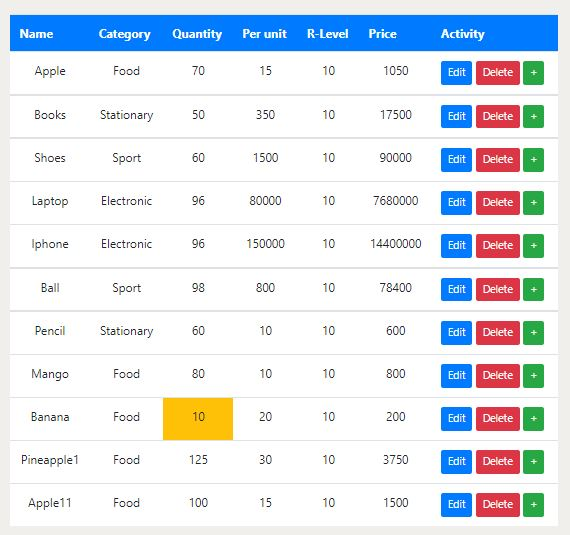  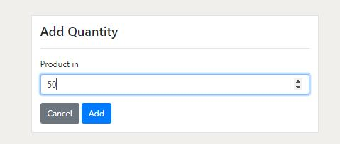

 If the product quantity is about to finish the warning is displayed as like above image and admin can add the quantity of a particuar product.  

 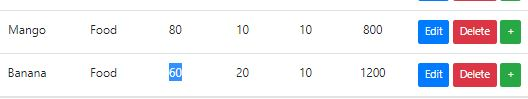

 After adding the quantity the warning is removed and the quantity is added like in the above image  

 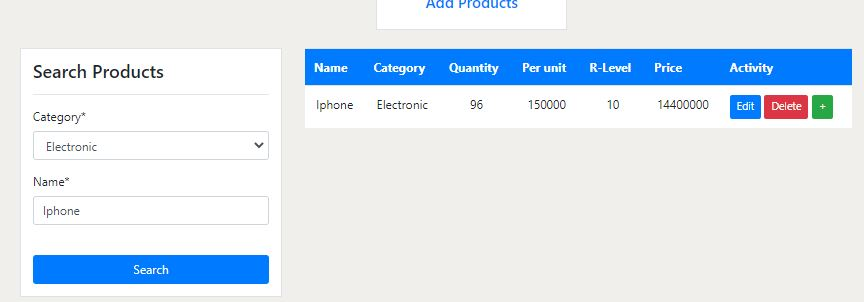 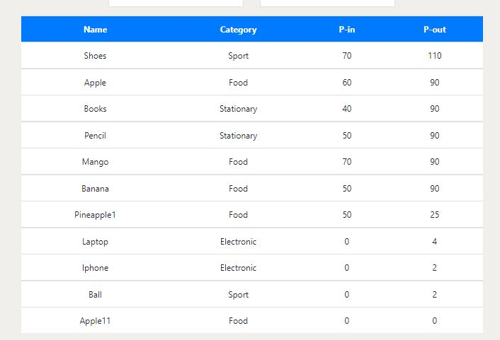

 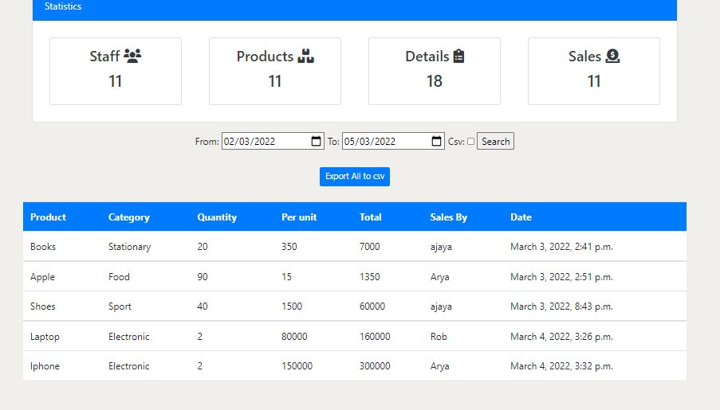 
 Can see the sales of particular date range and can export data to csv. 

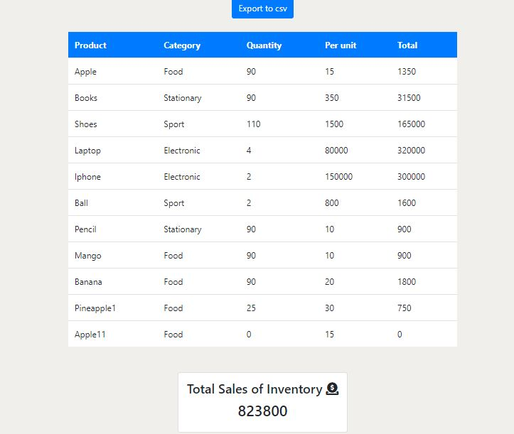

 Total sales of Inventory 

